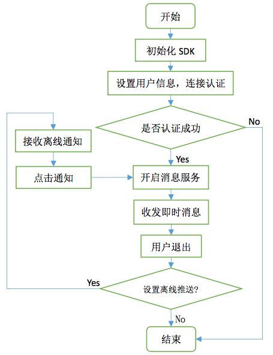

# V5KFClientSDK-Android
> 此为V5KF智能客服Android客户端SDK详细接口文档，无深入定制需求的客户可参考[基础文档](./README.md)。

- [1 术语](#1-术语)
- [2 功能说明](#2-功能说明)
- [3 业务流程](#3-业务流程)
  - [3.1 业务结构](#31-业务结构)
  - [3.2 交互流程](#32-交互流程)
  - [3.3 SDK工作流程](#33-sdk工作流程)
- [4 前期准备](#4-前期准备)
  - [4.1 开发环境准备](#41-开发环境准备)
  - [4.2 SDK导入](#42-sdk导入)
  	 - [4.2.1 导入eclipse](#421-导入eclipse)
  	 - [4.2.2 导入Android Studio](#422-导入android-studio)
  	 - [4.2.3 以文件导入](#423-以文件导入)
  - [4.3 配置AndroidManifest](#43-配置androidmanifest)
  - [4.4 了解离线消息推送](#44-了解离线消息推送)
- [5 使用SDK提供的UI快速集成](#5-使用sdk提供的ui快速集成)
  - [5.1 初始化SDK](#51-初始化sdk)
  - [5.2 消息推送设置](#52-消息推送设置)
  - [5.3 用户信息和参数设置](#53-用户信息和参数设置)
  - [5.4 启动会话界面](#54-启动会话界面)
  - [5.5 会话界面回调](#55-会话界面回调)
  - [5.6 会话界面自定义](#56-会话界面自定义)
- [6 使用SDK接口开发](#6-使用sdk接口开发)
  - [6.1 导入core库](#61-导入core库)
  - [6.2 代码快速集成](#62-代码快速集成)
	  - [6.2.1 初始化SDK](#621-初始化sdk)
	  - [6.2.2 开启消息服务](#622-开启消息服务)
	  - [6.2.3 消息接口调用](#623-消息接口调用)
	  - [6.2.4 生命周期处理](#624-生命周期处理)
	  - [6.2.5 用户信息设置](#625-用户信息设置)
	  - [6.2.6 查询会话消息](#626-查询会话消息)
	  - [6.2.7 查询服务状态](#627-查询服务状态)
	  - [6.2.8 其他设置](#628-其他设置)
  - [6.3 消息结构](#63-消息结构)
	  - [6.3.1 异常消息](#631-异常消息)
	  - [6.3.2 会话消息](#632-会话消息)
- [7 注意事项](#7-注意事项)
  - [7.1 代码混淆](#71-代码混淆)
  - [7.2 发布提醒](#72-发布提醒)
  - [7.3 版本更新](#73-版本更新)
- [更新记录](#更新记录)

## 1 术语
- **应用账号**: V5KF 网站后台 AppSDK 应用配置中的应用账号。
- **站点编号**: V5KF 网站的账号对应的站点编号(可以在 V5KF 官网后台查看或向客服获取)。 
- **Demo 工程**: 使用智能客服系统 SDK 客户端开发的接口使用示例工程。 
- **会话界面**: 针对使用本 SDK 的 iOS APP 而言，表示进行对话的一个 UIViewController。 
- **deviceToken**: 推送平台用于标识设备的唯一 ID，长度为 64 字节以内的字符串。
- **用户 ID(uid)**: （v1.2.0以上版本SDK已不建议使用，使用openId替代）标识 APP 所登录的用户的唯一 ID，长度为 64 字节以内的字符串。 
- **openId**: 标识 APP 所登录的用户的唯一 ID，长度为 32 字节以内的字符串，合法的openId将从App SDK端透传到座席端。
- **坐席**: 使用 V5 智能客服系统的客服登录席位，本文即指客服工作者。

## 2 功能说明
V5 智能客服系统客户端可集成到 web、APP 等第三方平台提供客户在线咨询服务，实时接收客户的反馈。支持发送文本、语音、图片以及表情等消息，并可显示图文、打开链接。

本文档介绍 V5 智能客服系统客户端 SDK 的 Android 版本的集成和使用。本 SDK 兼容 `Android API 9` 以上，并为开发者提供 Demo 工程，可以参照 Demo，使用 SDK 提供的 UI 快速集成到你的 项目中；对 UI 有较高定制需求的开发者可根据 SDK 接口进行开发，自行开发界面。

## 3 业务流程
### 3.1 业务结构


- V5智能云服务
> V5智能云服务，是连接座席和访客的桥梁。并通过云智能机器人，提供替代、协助座席进行优质客服的服务。
- V5客户端授权、认证服务
> 分发访客接入V5智能云服务的凭据服务器。

### 3.2 交互流程

- 客户端首先向 V5 客户端授权、认证服务发送认证信息(HTTP POST 请求方式)，以 获取连接 V5 智能云服务的授权信息;
- 用认证成功返回的授权信息向V5智能云服务建立会话连接;
- 开启会话，进行即时消息对话。


### 3.3 SDK工作流程


## 4 前期准备
### 4.1 开发环境准备

1. V5KF客服系统账号
> 没有 V5KF 账号需要前往[官网](http://www.v5kf.com)注册账号。

2. 获得应用账号、站点编号
> 应用账号、站点编号作为 SDK 连接服务端的身份凭证，可登录V5KF管理后台在 "系统接入" -> "移动应用APP" 配置界面获取。

3. 填写对应平台的推送服务器地址(非必需)
> 为了使您的 APP 在集成本 SDK 后具有离线消息推送，建议填写您的推送服务器地址，同时也支持第三方推送平台，需要按照本文档规定填写您的 device_token 和绑定的用户 ID。

4. 下载 SDK
> 您可以到 V5KF [官网](http://www.v5kf.com)或者[V5KF Github](https://github.com/V5KF/V5KFClientSDK-iOS)*(建议)*页下载智能客服 SDK，包含了开发包和带 UI 界面的 Demo 示例工程。

5. 环境要求
> 在您集成智能客服 SDK 前环境要求如下:
	- Android SDK `Build-tools` 请升级到 21 及以上版本。
	- JAVA 编译版本 `JDK 1.7` 及以上版本。
	- 编译 Demo 需要 Android Support V7 22.1(含 AppCompatActivity) 及以上版本(需导入支持包 `android-support-v7-appcompat`)。
	- Android SDK 最低支持 Android API 9: Android 2.3(Gingerbread)。

### 4.2 SDK导入
导入 SDK 可以将 SDK 文件复制到您的项目中也可作为 library (eclipse) 或 module (Android Studio) 导入，建议采用导入 `Library` 方式，便于 SDK 维护和升级。

#### 4.2.1 导入eclipse
* 在`eclipse/`目录下将`V5ClientLibrary/`目录作为`library`项目导入eclipse：

> 右键eclipse项目列表 Import -> Existing Android Code Into Workspace -> 选择本地`V5ClientLibrary`所在目录 -> finish

* 在您的项目中添加`V5ClientLibrary`为`library`：

> 项目文件夹右键 Properties -> Android -> Library -> Add -> 选择`V5ClientLibrary`

* 编译环境：

> Android SDK需使用API 19以上版本

#### 4.2.2 导入Android Studio

以下方式二选一：

* 1.配置gradle的dependencies添加远程依赖：

```
dependencies {
    compile 'com.v5kf.clientsdk:clientsdk:1.2.12'
}
```

* 2.将V5ClientLibrary目录作为`Module`导入：

> 在Android Studio选择 File -> New -> Import Module -> 选择本地`V5ClientLibrary`所在目录 -> Finish

#### 4.2.3 以文件导入
1. 将 SDK 压缩包 `V5ClientLibrary` 中的 res 文件夹复制到您项目的对应 `res` 文件夹下;
2. 将 SDK 压缩包内的 `V5KF _1.x.x_rxxxx.jar` 复制到您的项目的 `libs` 文件夹下;

> 注:上述文件名称中的“x”表示 0~9 中某一数字，表示版本代号，下同。

### 4.3 配置AndroidManifest
可以参考 Demo 工程的 `AndroidManifest.xml` 文件来配置您的 AndroidManifest，无论是 使用 SDK 的接口开发还是直接使用 Demo 工程的 UI 快速集成都需要对您的项目的 `AndroidManifest.xml` 文件进行下述配置，具体配置项目如下:

- **1. 添加必需的权限**

```xml
<!-- 网络访问权限 -->
<uses-permission android:name="android.permission.INTERNET" />
<!-- 获取网络状态权限 -->
<uses-permission android:name="android.permission.ACCESS_NETWORK_STATE" />
<!-- 相机权限 -->
<uses-permission android:name="android.permission.CAMERA" />
<!-- 往 SDCard 写入数据权限 -->
<uses-permission android:name="android.permission.WRITE_EXTERNAL_STORAGE" />
<uses-permission android:name="android.permission.MOUNT_UNMOUNT_FILESYSTEMS" />
<!-- 录音权限 -->
<uses-permission android:name="android.permission.RECORD_AUDIO" />
```

- **2. 配置使用自定义的 Application**

在 Application 的 `onCreate` 中需要进行 SDK 的初始化，故需要自定义自己的
Application 类，并在 AndroidManifest.xml 中进行下面配置（若您的项目中已有自定义的Application基类，则可不必关心此项）:

```xml
<application
   android:allowBackup="true"
   android:name="com.your.package.您的自定义 Application 类" 
   android:icon="@drawable/ic_launcher" 
   android:label="@string/app_name" 
   android:theme="@style/AppTheme" >
	<!-- 其他内容 --> 
</application>
```

- **3. 添加必需的服务和 Activity**

```xml
<activity
	android:name="com.v5kf.client.ui.ClientChatActivity" 	android:configChanges="keyboardHidden|orientation|screenSize" 
	android:label="@string/v5_chat_title" 
	android:launchMode="singleTask" 
	android:windowSoftInputMode="adjustResize" >
</activity>
<service 
	android:name="com.v5kf.client.lib.V5ClientService" >
</service>
<activity android:name="com.v5kf.client.ui.WebViewActivity" >
</activity>
<activity
	android:theme="@style/v5_transparent_activity"
	android:name="com.v5kf.client.ui.ShowImageActivity" > 
</activity>
```

为兼容Android 7.0，1.2.10版本开始需要配置provider(application内)

```xml
<provider
    android:name="com.v5kf.client.lib.V5FileProvider"
    android:authorities="com.v5kf.client.fileprovider"
    android:exported="false"
    android:grantUriPermissions="true">
    <meta-data
        android:name="android.support.FILE_PROVIDER_PATHS"
        android:resource="@xml/v5_file_paths">
    </meta-data>
</provider>
```

### 4.4 了解离线消息推送
此项为客户接收离线消息用，非必需。客户离线后可将此时客服发送的消息推送到您指定的推送服务器或者第三方推送平台，需要在 V5 官网后台做对应配置，选择对应推送平台并配置，否则离线后接收不到消息:


1. 您自己的推送服务器
	
	> 应用配置须填写: 推送服务器接口地址，V5 系统将 POST 离线消息到您的服务器接口。
	
	> APP 代码中需设置: `V5ClientConfig.getInstance(Context).setDeviceToken("识别您的推送终 端的唯一 ID")`。

2. 第三方推送平台
  
  - 信鸽推送
	  
	> 应用配置须填写: ACCESS ID 和 SECRET KEY
	
	> APP 代码中需设置: `V5ClientConfig.getInstance(Context).setDeviceToken("信鸽 SDK 中获取到的 token")`。
	
  - 百度云推送
  	
	> 应用配置须填写: API KEY 和 SECRET KEY
	
	> APP 代码中需设置: `V5ClientConfig.getInstance(Context).setDeviceToken("百度云 SDK 中获 取到的 channel_id")`。
	
  - 其他平台待补充
  
> 注: 从第三方推送平台接收到消息会附带有自定义参数`"v5_action":"new_message"`(键值对)，在对应的推送 SDK 接口中获取，以识别此消息来自 V5 智能客服。

## 5 使用SDK提供的UI快速集成
### 5.1 初始化SDK
初始化需要在您自定义的 Application 中执行，示例如下:

```java
public class MyApplication extends Application {
	@Override
	public void onCreate() {
		// TODO Auto-generated method stub 
		super.onCreate();
		if (isMainProcess()) { // 判断为主进程，在主进程中初始化，多进程同时初始化可能导致不可预料的后果
			Logger.w("MyApplication", "onCreate isMainProcess V5ClientAgent.init");
			V5ClientAgent.init(this, "<站点编号>", "<APP ID>",  new V5InitCallback() {
				
				@Override
				public void onSuccess(String response) {
					// TODO Auto-generated method stub
					Logger.i("MyApplication", "V5ClientAgent.init(): " + response);
				}
				
				@Override
				public void onFailure(String response) {
					// TODO Auto-generated method stub
					Logger.e("MyApplication", "V5ClientAgent.init(): " + response);
				}
			});
		}
	}
	
	public boolean isMainProcess() {
		ActivityManager am = ((ActivityManager) getSystemService(Context.ACTIVITY_SERVICE));
		List<RunningAppProcessInfo> processInfos = am.getRunningAppProcesses();
		String mainProcessName = getPackageName();
		int myPid = android.os.Process.myPid();
		for (RunningAppProcessInfo info : processInfos) {
			if (info.pid == myPid && mainProcessName.equals(info.processName)) {
				return true;
			}
		}
		return false;
	}
}
```

其中 `<站点编号>` 和 `<APP ID>` 分别是从 V5 后台可以获取到的站点编号和AppID。


### 5.2 消息推送设置
推送参数设置:

```java
V5ClientConfig config = V5ClientConfig.getInstance(Context context);
//【建议】否则离线无法接收通知，离线消息通知发送到在 V5KF 后台配置的对应推送服务器地址，或者第三方推送平台
config.setDeviceToken("device_token 字符串"); 
```
推送消息接受会收到后，在通知栏点击时需要打开客服会话界面。若您使用第三方推送平台将会返回一组自定义参数 `"v5_action" : "new_message"`，以此区分是否是来自 V5 智能客服系统的消息；若您使用自己的推送服务器，您可以在接收到消息后自行标记此消息并推送到客户端 APP(根据 `device_token` 识别接收客户端)，进行启动客服会话界面处理，启动会话界面参考 [5.4](#54-启动会话界面)。

### 5.3 用户信息和参数设置
使用 SDK 提供的 UI 集成，需要在启动会话界面之前进行用户信息和参数配置。配置项如下:

```java
V5ClientConfig config = V5ClientConfig.getInstance(MainActivity.this); 
// V5客服系统客户端配置(以下值均为默认值，仅作示例，不需修改可不必设置) 
// V5ClientConfig.USE_HTTPS = true; // 使用加密连接，默认true 
// V5ClientConfig.AUTO_RETRY_ONERROR = true; // 链接错误时是否自动重试链接，默认true，否则弹出提示框选择是否重试
// V5ClientConfig.SOCKET_TIMEOUT = 20000; // 设置连接超时20s 
// config.setShowLog(true); // 显示日志，默认为true 
// config.setLogLevel(V5ClientConfig.LOG_LV_VERBOSE); // 显示日志级别，默认为全部显示

/*** 客户信息设置 ***/
// 【建议】设置用户昵称 
config.setNickname("android_sdk_test");
// 设置用户性别: 0-未知 1-男 2-女
config.setGender(1); 
// 【建议】设置用户头像URL
config.setAvatar("http://debugimg-10013434.image.myqcloud.com/fe1382d100019cfb572b1934af3d2c04/thumbnail"); 
/**
 *【建议】设置用户OpenId，以识别不同登录用户，不设置则默认由SDK生成，替代v1.2.0之前的uid,
 *  openId将透传到座席端(长度32字节以内，建议使用含字母数字和下划线的字符串，尽量不用特殊字符，若含特殊字符系统会进行URL encode处理，影响最终长度和座席端获得的结果)
 *	若您是旧版本SDK用户，只是想升级，为兼容旧版，避免客户信息改变可继续使用config.setUid，可不用openId
 */
config.setOpenId("android_sdk_test");
//config.setUid(uid); //【弃用】请使用setOpenId替代
// 设置用户VIP等级(0-5)
config.setVip(0);
// 使用消息推送时需设置device_token:集成第三方推送(腾讯信鸽、百度云推)或自定义推送地址时设置此参数以在离开会话界面时接收推送消息
config.setDeviceToken(XGPushConfig.getToken(getApplicationContext())); 

// 客户信息键值对，下面为示例（JSONObject）
JSONObject customContent = new JSONObject();
try {
	customContent.put("用户名", "V5KF");
	customContent.put("用户级别", "VIP");
	customContent.put("用户积分", "3000");
	customContent.put("浏览商品", "衬衣");
} catch (JSONException e) {
	e.printStackTrace();
}
// 【新】设置客户信息（自定义JSONObjectjian键值对，开启会话前设置，替代之前通过`setUserWillSendMessageListener`在消息中携带信息的方式，此方式更加安全便捷）
config.setUserInfo(customContent);
```

当 `nickname`、`openId`、`avatar`、`device_token` 等配置项配置完，下次需要修改(如App内切换了登录账号，修改了客户昵称或头像时)并向座席更新时需要在开启会话前调用 **`V5ClientConfig.getInstance(context).shouldUpdateUserInfo()`**，这样才会向服务端更新这几个配置项。
同样若想更新站点信息（站点信息包含机器人信息和转人工开场白等V5后台可设置的信息，系统会隔7天自动更新，一般无需处理），需要在`onChatActivityConnect`中调用 **`V5ClientAgent.getInstance().updateSiteInfo()`**。

### 5.4 启动会话界面
通过简单地添加一个在线咨询按钮即可使用智能客服客户端功能，在按钮点击事件处理中加入:

```java
// 开启对话界面 
V5ClientAgent.getInstance().startV5ChatActivity(getApplicationContext());
```

若有自定义界面参数需求，SDK 界面也可以设置传入参数，具体内容如下:

```java
/* 开启会话界面(以下值均为默认值，仅作示例，不需修改可不必设置) */
// 可用Bundle传递以下参数
Bundle bundle=new Bundle();
bundle.putInt("numOfMessagesOnRefresh", 10); // 下拉刷新数量，默认为10
bundle.putInt("numOfMessagesOnOpen", 10); // 开场显示历史消息数量，默认为10
bundle.putBoolean("enableVoice", true); // 是否允许发送语音
bundle.putBoolean("showAvatar", true); // 是否显示对话双方的头像
// 开场白模式，默认为固定开场白，可根据客服启动场景设置开场问题 
bundle.putInt("clientOpenMode", ClientOpenMode.clientOpenModeDefault.ordinal()); 
//bundle.putString("clientOpenParam", "您好，请问有什么需要帮助的吗?"); 
// clientOpenModeDefault情况下不设置clientOpenParam则采用V5后台配置的机器人开场白(可在后台修改)

// 进入会话界面，携带bundle(不加bundle参数则全部使用默认配置)
V5ClientAgent.getInstance().startV5ChatActivityWithBundle(getApplicationContext(), bundle);
```

ClientOpenMode包含四种**开场消息**模式，分别为:

```java
public enum ClientOpenMode {
	clientOpenModeDefault, // 默认开场白方式(无历史消息显示则显示开场白，优先以设置的param字符串为开场白，param为null则使用后台配置的开场白) 
	clientOpenModeQuestion, // 自定义问题开场白，param字符串为问题内容(不为空)，设置开场问题获得对应开场白(此模式不可与优先人工客服同用，否则将失效) 
	clientOpenModeNone, // 无开场白方式，仅显示历史消息 
	clientOpenModeAutoHuman // 开场自动转人工客服
};
```

### 5.5 会话界面回调
对 SDK 中界面上面的内容操作可以设置自定义的处理方式，以实现更多自定义功能，接口如下(详细使用方法参考 Demo)。

**会话界面的生命周期监听**

```java
// 界面生命周期监听[非必须] 
V5ClientAgent.getInstance().setChatActivityListener(OnChatActivityListener listener);
```

其中 `OnChatActivityListener` 接口如下:

```java
/**
 * 使用UI直接开发可监听此接口
 * (针对有较高自定义开发需求的接口，无特殊需求不建议使用，以免使用不当带来不可预知的问题)
 */
public interface OnChatActivityListener {
	/* Activity的生命周期 */
	public void onChatActivityCreate(ClientChatActivity activity); 
	public void onChatActivityStart(ClientChatActivity activity); 
	public void onChatActivityStop(ClientChatActivity activity); 
	public void onChatActivityDestroy(ClientChatActivity activity);

	/**
	 * Activity连接成功
	 */
	public void onChatActivityConnect(ClientChatActivity activity);

	/**
	 * Activity收到消息 
	 * @param message
	 */
	public void onChatActivityReceiveMessage(ClientChatActivity activity, V5Message message);

	/**
	 * Activity客户服务状态改变
	 * @param activity
	 * @param status ClientServingStatus，当前服务状态，值定义如下
 	 *	   clientServingStatusRobot, // 机器人服务 
 	 *	   clientServingStatusQueue, // 排队中(等待人工客服，当前机器人服务)
 	 *	   clientServingStatusWorker, // 人工服务 
 	 *	   clientServingStatusInTrust; // 人工交给机器人托管
 	 */
	public void onChatActivityServingStatusChange(ClientChatActivity activity, ClientServingStatus status);
}
```
消息发送监听:

```java
// 消息发送监听[非必须]，可在此处向坐席透传来自APP客户的相关信息 
V5ClientAgent.getInstance().setUserWillSendMessageListener(new UserWillSendMessageListener() {
	@Override
	public V5Message onUserWillSendMessage(V5Message message) {
		// 可在此处添加消息参数(JSONObject键值对均为字符串)，采集信息透传到坐席端（v1.2.0版本开始不建议使用此方式，除非有实时更新需求的自定义信息）
		// 【注意】v1.2.0以上版本建议使用V5ClientConfig的setUserInfo方法传递客户信息，可不必依附于消息，更加安全便捷，详见[5.3](#53-用户信息和参数设置)
		// if (flag_userBrowseSomething) {
		// 	JSONObject customContent = new JSONObject(); 
		// 	try {
		// 		customContent.put("用户级别", "VIP"); 
		// 		customContent.put("用户积分", "300"); 
		// 		customContent.put("来自应用", "ClientDemo");
		// 	} catch (JSONException e) { 
		// 		e.printStackTrace();
		// 	}
		// 	message.setCustom_content(customContent); 
		// }
		return message; // 注:必须将消息对象以返回值返回 
	}
});
```
设置 URL 链接点击监听:

```java
V5ClientAgent.getInstance().setURLClickListener(new OnURLClickListener() {

			@Override
			public boolean onURLClick(Context context, V5ClientAgent.ClientLinkType type, String url) {
				// TODO Auto-generated method stub
				switch (type) {
				case clientLinkTypeArticle: // 点击图文
					break;
				case clientLinkTypeURL: // 点击URL链接
					break;
				case clientLinkTypeEmail: // 点击电子邮件
					break;
				case clientLinkTypePhoneNumber: // 点击电话号码
					break;
				}
				return false; // 是否消费了此点击事件
			}
		});
```

`ClientLinkType`链接的类型包括：

```java
public enum ClientLinkType {
	clientLinkTypeURL,			//网页链接
	clientLinkTypeArticle,		//图文链接
	clientLinkTypeEmail,		//电子邮箱
	clientLinkTypePhoneNumber	//电话
}
```

设置地图位置消息点击监听:

```java
V5ClientAgent.getInstance().setLocationMapClickListener(OnLocationMapClickListener listener);
```

设置输入框底部功能按钮点击监听: 

```java
/**
 * 点击对话输入框底部功能按钮
 */
V5ClientAgent.getInstance().setChatActivityFuncIconClickListener(new ChatActivityFuncIconClickListener() {
	
	/**
	 * Activity点击底部功能按钮事件，icon参数值及含义如下：
	 * 		v5_icon_ques			//常见问题
	 * 		v5_icon_relative_ques	//相关问题
	 * 		v5_icon_photo			//图片
	 * 		v5_icon_camera			//拍照
	 * 		v5_icon_worker			//人工客服
	 * 返回值代表是否消费了此事件
	 * @param icon 点击的图标名称(对应SDK目录下res/values/v5_arrays中v5_chat_func_icon的值)
	 * @return boolean 是否消费事件(返回true则不响应默认点击效果，由此回调处理)
	 */
	@Override
	public boolean onChatActivityFuncIconClick(String icon) {
		// 在这里可以实现点击事件的自定义处理，如下示例点击“人工客服”转指定客服
		if (icon.equals("v5_icon_worker")) {
			// 转到指定客服,参数：(组id, 客服id),参数为0则不指定客服组或者客服
			V5ClientAgent.getInstance().transferHumanService(0, 0);
			// 返回true来拦截SDK内默认的实现
			return true;
		}
		return false;
	}
});
```

### 5.6 会话界面自定义
参考 [5.4](#54-启动会话界面) 中，可设置是否允许发送语音和显示头像，此外会话界面中加号打开的功能面版亦支持自定义。
通过修改V5ClientLibrary库中res/values/v5_arrays.xml可以控制对应功能项按钮是否显示。

```xml
<?xml version="1.0" encoding="utf-8"?>
<resources>
    <!-- 可以增加或删除item，自定义功能(对应界面的功能按钮标题和图片) -->
    <!-- 不需要的功能可删除对应行(两个array的对应item均删除) -->
    <string-array name="v5_chat_func"><!-- 顺序对应界面功能按钮标题 -->
        <item>常见问题</item>
        <item>相关问题</item>
        <item>图片</item>
        <item>拍照</item>
        <item>人工客服</item>
    </string-array>

    <string-array name="v5_chat_func_icon"><!-- 顺序对应界面功能按钮图标 -->
        <item>v5_icon_ques</item>
        <item>v5_icon_relative_ques</item>
        <item>v5_icon_photo</item>
        <item>v5_icon_camera</item>
        <item>v5_icon_worker</item>
    </string-array>
</resources>
```
可自定义是否显示的功能项如下图：


## 6 使用SDK接口开发
> 注: 建议使用 SDK 提供的 UI 库直接集成（详见[5](#5-使用sdk提供的ui快速集成)），无特殊需求不建议使用 SDK 接口开发，因客服消息包含文本、图片、语音、图文等多种类型，单独开发消息逻辑复杂度高、难度较大，耗费人力。

### 6.1 导入core库
将下载的 SDK 压缩包内 `Others` 目录下的 `V5KF_core_1.x.x_rxxxx.jar` 文件复制到您的项目 `libs` 目录下，并复制该目录下的 `v5_strings.xml` 到你的 `values` 下。

### 6.2 代码快速集成
在会话界面需要添加SDK lib中的代码，将消息服务集成到您的项目中。具体接口调用和代码添加如下。

#### 6.2.1 初始化SDK
SDK 初始化参考 [5.1](#51-初始化sdk)。

#### 6.2.2 开启消息服务
在会话界面 Activity 的 `onCreate` 中调用:

```java
// 开启消息服务
V5ClientAgent.getInstance().start(Context context, V5MessageListener listener);
```
其中 `V5MessageListener` 是消息回调监听器:

```java
public interface V5MessageListener {
    public void onConnect(int unreadSize); // 建立连接，参数：连接后获取到未读消息数量
    public void onMessage(String json); // 返回消息为json字符串(兼容后期接口类型扩展)
    public void onMessage(V5Message message); // 返回消息对象
    public void onError(V5KFException error); // 返回异常信息
    public void onServingStatusChange(ClientServingStatus status); // 客户服务状态改变
}
```

初始化内容包括:

1. 设置消息回调监听器;
2. 向 V5 认证服务进行客户端认证，根据 `AndroidManifest` 配置的站点信息和客户端生成的客户 ID 向认证服务器认证(这之前可进行客户端用户信息设置，参见 [6.2.5](#625-用户信息设置))，获取会话参数;
3. 认证成功并返回参数后开启 `V5ClientService` 消息服务。

#### 6.2.3 消息接口调用

获得**开场白**:

```java
/**
 * 获得开场消息
 * @param mode 开场白模式(定义见5.4) 
 * @param param 可变参数
 */
public void getOpeningMessage(ClientOpenMode mode, String param)
```

发送消息调用:

```java
V5ClientAgent.getInstance().sendMessage (V5Message message, MessageSendCallback callback);
```

发送消息的第一个参数是 `V5Message` 消息对象，支持发送文本消息、位置消息、图片消息、控制消息:

```java
// 新建文本消息
V5TextMessage textMsg = V5MessageManager.getInstance().obtainTextMessage(“消息内容”);
// 新建位置消息
V5LocationMessage locationMsg = V5MessageManager.getInstance().
	obtainLocationMessage(
       double latitude,		// 纬度
       double longitude,	// 经度
       double accuracy,		// 精度,可为0
       String address);		// 地址描述，可为null

// 新建图片消息——发送本地图片
V5ImageMessage imageMsg = V5MessageManager.getInstance().obtainImageMessage(
		String filePath); 	// 本地图片路径 
// 新建图片消息——发送网络图片
V5ImageMessage imageMsg = V5MessageManager.getInstance().obtainImageMessage(
		String pic_url,		// 图片URL
		String media_id); 	// 媒体ID，可为null
// 新建控制消息
V5ControlMessage controlMsg = V5MessageManager.getInstance().obtainControlMessage(
		int code, 		// 代码
		int argc, 		// 参数数量，可为0，即参数可为空
		String argv); 	// 参数值(字符串)，可为null
// 目前开放的控制消息为转人工客服消息:code = 1，其他参数为空，示例如下:
V5Message msg = V5MessageManager.getInstance().obtainControlMessage(1, 0, null);
```

发送消息的第二个参数 `MessageSendCallback` 为消息发送结果回调:

```java
public interface MessageSendCallback {
	public void onSuccess(V5Message message); // 成功
	public void onFailure(V5Message message, int statusCode, String desc); // 失败 
}
```

**转人工客服**可调用:

```java
// 请求人工客服服务
V5ClientAgent.getInstance().switchToArtificialService(MessageSendCal lback callback);
```

不需要客服消息服务时需要关闭消息服务:

```java
V5ClientAgent.getInstance().onDestroy(); // 关闭消息服务
```

关闭消息服务表示用户下线，即无法继续接收消息，当用户再次进入会话界面时才能继续消息请求和接收，用户下线后消息将会缓存。若设置了离线消息的推送服务器地址，您的服务器将会收到用户下线后的离线消息，可选择自行推送到您的 APP，或者保存到您的服务端，此外可选择对接到第三方推送平台，目前已支持腾讯信鸽推送和百度云推送。

#### 6.2.4 生命周期处理

添加到会话界面 Activity 中 `onStart`、`onStop` 和 `onDestroy` 中处理的代码:

```java
@Override
protected void onStart() {
	super.onStart();
	V5ClientAgent.getInstance().onStart(); // 通知消息服务 onStart 
}
@Override
protected void onStop() {
	super.onStop();
	V5ClientAgent.getInstance().onStop(); // 通知消息服务 onStop
}

@Override
protected void onDestroy() { 
	super.onDestroy();
	V5ClientAgent.getInstance().onDestroy();// 关闭消息服务，通知消息服务onDestroy
}
```

#### 6.2.5 用户信息设置

`V5ClientConfig` 的配置需要在执行 SDK 的 `startChat***` 方法初始化之前设置，非必须，但设置易识别的用户信息有助于客服识别客户，提高客服效率和服务质量，具体代码如下:

```java
V5ClientConfig config = new V5ClientConfig(Context context);
//【建议】设置昵称
config.setNickname("昵称"); 
//【建议】设置头像URL
config.setAvatar("http://static.v5kf.com/images/web/fodder/xlogo.png");
/**
 *【建议】设置用户OpenId，以识别不同登录用户，不设置则默认由SDK生成，替代v1.2.0之前的uid,
 *  openId将透传到座席端(长度32字节以内，建议使用含字母数字和下划线的字符串，尽量不用特殊字符，若含特殊字符系统会进行URL encode处理，影响最终长度和座席端获得的结果)
 */
config.setOpenId("android_sdk_test");
//config.setUid(uid); //【弃用】请使用setOpenId替代
// 设置性别 0-未知 1-男 2-女
config.setGender(1); 
// 设置用户VIP等级(0-5) 
config.setVip(0); 
// 设置device_token:集成第三方推送(腾讯信鸽、百度云推)时设置此参数以在离开会话界面时接收推送消息
config.setDeviceToken(String device_token);

//当nickname、uid、avatar、device_token等配置项配置完下次需要修改并向座席更新时
//需要调用shouldUpdateUserInfo()，这样才会向服务端更新这几个配置项
config.shouldUpdateUserInfo();
```

推送消息接受会收到后，在通知栏点击时需要打开客服会话界面。若您使用第三方推送平台将会返回一组自定义参数 `"v5_action" : "new_message"`，以此区分是否是来自 V5 智能客服系统的消息；若您使用自己的推送服务器，您可以在接收到消息后自行标记此消息并推送到客户端 APP(根据 `device_token` 识别接收客户端)，然后启动您自定义的客服会话界面。

#### 6.2.6 查询会话消息

- 1. 当**开启消息缓存**时，可以通过下面的接口查询缓存的历史消息:

```java
V5ClientAgent.getInstance().getMessages(int offset, int size, OnGetMessagesCallback callback)
```

其中 `offset` 为请求起始位置，`size` 为最多返回消息数，返回的 `finish` 为 true 时说明已没有更多会话，`offset` 和 `size` 均为 0 时表示查询当前会话全部消息。`OnGetMessagesCallback` 为获取历史消息的回调，以表示历史消息获取成功，参数为消息对象列表:

```java
public interface OnGetMessagesCallback {
	// 执行完成
	public void complete(List<V5Message> msgs, int offset, int size, boolean finish);  
}
```

此外，提供**清空历史消息缓存**接口:

```java
V5ClientAgent.getInstance().clearLocalHistoricalMessages(Context context);
```

- 2. 查询**离线消息**

```java
V5ClientAgent.getInstance().getOfflineMessages(int offset, int size, OnGetMessagesCallback callback)
```

其中 `offset` 为请求起始位置，`size` 为最多返回消息数，返回的 `finish` 为 true 时说明已没有更多会话，offset 和 size 均为 0 时表示查询当前会话全部消息， `OnGetMessagesCallback` 为获取离线消息的回调，使用 UI 库开发时不需要设置此回调(设为 null)，SDK 自行处理此回调获得的消息并显示在消息列表。

> 注: `getOfflineMessages` 接口的 `offset` 参数已被后台忽略，设置无效，一次查询全部离线消息，offset 和 size 均设定为 0 即可。

#### 6.2.7 查询服务状态

获取会话服务状态:

```java
V5ClientAgent.getInstance().getStatus();
```

状态返回在 `V5MessageListener` 的 `onServingStatusChange` 中回调:

```java
public void onServingStatusChange(ClientServingStatus status);
```

客服状态值和含义如下:

```java
public enum ClientServingStatus {
	clientServingStatusRobot, // 机器人服务 
	clientServingStatusQueue, // 排队中(等待人工客服，当前为机器人服务)
	clientServingStatusWorker, // 人工服务 
	clientServingStatusInTrust; // 人工交给机器人托管
}
```

#### 6.2.8 其他设置

客户端的调试日志显示和其他配置(以下设置值为 SDK 内默认值):

```java
// V5客服系统客户端配置(以下值均为默认值，仅作示例，不需修改可不必设置) 
V5ClientConfig config = V5ClientConfig.getInstance(this); 
V5ClientConfig.USE_HTTPS = true; // 使用加密连接，默认true 
V5ClientConfig.SOCKET_TIMEOUT = 20000; // 默认设置请求超时时间20s 

// 是否需要界面支持(涉及到离线消息自动获取和本地缓存)
V5ClientConfig.UI_SUPPORT = false; // 使用UI快速集成须设此项为true

// 是否允许本地缓存消息(UI_SUPPORT true时需设置此项为true) 
config.setLocalMessageCacheEnable(true); 

config.setHeartBeatEnable(true); // 允许发送心跳包保活 
config.setHeartBeatTime(30000); // 心跳包间隔30000ms 
config.setShowLog(true); // 显示日志，默认为true
config.setLogLevel(V5ClientConfig.LOG_LV_DEBUG); // 显示日志级别，默认 为全部显示
// 清除缓存，语音、图片等缓存在应用data/cache目录下 
V5ClientAgent.clearCache(Context context);
```

### 6.3 消息结构
#### 6.3.1 异常消息


异常消息通过 `MessageListener` 的 `onError(V5KFException e)` 函数回调，上表列出了来自服务端的异常代码和对应含义(`ExceptionServerResponse` 类型的异常)，SDK 中的异常类型通过枚举定义，具体如下:

```java
public enum V5ExceptionStatus {
	ExceptionNoError, 				// 没有错误
	ExceptionNotInitialized, 		// SDK未初始化或初始化失败
	ExceptionAccountFailed, 		// 账号信息认证失败
	ExceptionNotConnected, 			// 尚未建立连接
	ExceptionMessageSendFailed,	// 消息发送失败(MessageSendCallback参数)
	ExceptionImageUploadFailed,	// 图片上传失败
	ExceptionNoNetwork, 			// 未连接到网络
	ExceptionConnectionError, 		// 网络请求错误
	ExceptionWSAuthFailed, 			// ws的Authorization认证失败
	ExceptionConnectRepeat, 		// 客户端出现重复连接
	ExceptionServerResponse, 		// 错误类型为服务器返回
	ExceptionNoAudioPermission,	// 无录音权限 
	ExceptionUnknownError; 			// 未知错误
}
```

#### 6.3.2 会话消息

发送和接收消息都是 JSON 格式字符串，其中 `o_type` 为 `message` 的消息为会话消息，通过转换为消息对象 `V5Message` 传递，包含文本、位置、图片等子类消息，基类 `V5Message `中主要成员定义如下:

```java
private int state; // 消息状态发送状态
private int hit;	// 问题命中与否: 
					// 0-问题未能有效回答 
					// 1-问题找到合适答案 
private int message_type; // 消息类型
private String message_id; // 消息ID
private long msg_id; // 自定义消息ID，若传出去的消息携带此id则对应的机器人回复也携带此ID
private int direction;	// 消息标志，定义如下:
							// 0 – 座席发出的消息
							// 1 – 客户发出的消息
							// 2 – 机器人发出的消息
							// 7 – 发给座席的求助信息 
							// 8 – 相关问题消息 
							// 9–评价问卷
private long create_time; // 时间戳
private List<V5Message> candidate; // 相关问题内容
protected JSONObject custom_content; // 自定义magic参数，键值对数组形式
```

消息状态有:`V5Message.STATE_ARRIVED` 、`V5Message.STATE_FAILURE` 、 `V5Message.STATE_SENDING`、`V5Message.STATE_UNKNOW` 四种。

`V5Message` 是所有类型消息的基类，通过“`message_type`”来区分消息类型，单个消息仅包含一种类型的消息内容，目前支持的消息类型示例如下。

消息内容中不同消息类型对应的成员定义如下:


当接收到的消息类型为 SDK 所不支持的类型时，该类型会以 `V5JSONMessage` 来表示，内含一个 JSONObject 类型成员，包含接收到的完整消息内容。

会话应答消息通过`MessageListener`的`onMessage(V5Message message)`函数回调，接收到的文本消息示例如下，即一个 `V5TextMessage` 包含的信息:

```json
{
	"content": "你好!", 
	"create_time": "1447323666", 
	"direction": 2,
	"hit": 1,
	"message_type": 1,
	"o_type": "message"
}
```

接收文本消息的处理:

```java
public void onMessage(V5Message message) {
	if (message.getMessage_type() == V5MessageDefine.MSG_TYPE_TEXT) {
		V5TextMessage textMessage = (V5TextMessage) message;
		// 处理文本消息
		// ......	
	}
}
```

## 7 注意事项
### 7.1 代码混淆
代码混淆时需要在混淆配置文件中加入下面内容(v1.2.0 以后版本不需要添加混淆项):

```
# v1.2.0 以后版本不需要添加混淆项
-keepattributes InnerClasses -keep class **.R$* { <fields>; }
#含腾讯地图 SDK 还需加入 
-dontwarn org.eclipse.jdt.annotation.** 
-keepattributes *Annotation* 
-keepclassmembers class ** {
	public void on*Event(...); 
}
-keepclasseswithmembernames class * { 
	native <methods>;
}
```

### 7.2 发布提醒
应用发布时注意关闭日志打印。此外，使用不带 UI 的核心库接口开发的开发者，要注意其中 [6.2.4](#624-生命周期处理) 生命周期的处理不可以遗漏。

### 7.3 版本更新
SDK 存在新版本时，请尽量更新到最新版本 SDK，注意查看文档末尾的更新记录，以根据更新内容完成相应修改。

## 更新记录

- 2015/12/15 文档版本 Ver0.6，SDK 版本 v1.0.2
	1. 【修改】修改消息发送回调接口名称:`MessageSendHandler` -> `MessageSendCallback`。
	2. 【增加】消息接口 `V5MessageListener` 增加方法:`onConnect()`，表示与服务端连接建立成功，方可开始发送消息。
	3. 【增加】`V5ClientConfig` 中增加用户 uid(区分多用户账号切换情况)设置和推送设 备 `device_token` 设置，须填写上第三方推送平台的 `device_token` 以识别推送终端。
	4. 【增加】增加本地图片发送功能。
	5. 【修改】修改 `AndroidManifest.xml` 中的 activity 和 service 的配置，取消`android:process=":v5kf"`，解决因多进程中单例多个实例化导致的 `V5ClientConfig` 配置信息失败问题。
	6. 【增加】增加客户离线后消息推送到第三方平台，需要在 V5 官网后台做对应配置，选择对应推送平台并配置，否则离线后接收不到消息。

- 2015/12/17 文档版本 Ver0.7，SDK 版本 v1.0.3
	1. 【修改】(deprecated)取消 SDK 中 `APP_KEY` 的填写，修改了 SDK 初始化认证方式。

- 2016/03/08 文档版本 Ver0.8，SDK 版本 v1.0.4
	1. 【修改】异常状态类型使用枚举 `V5ExceptionStatus` 替换。
	2. 【增加】增加接口 `getOpeningMessage` 获取开场消息，提供三种开场消息方式，并增加开场显示历史消息条数和下拉刷新消息数量配置。
	3. 【修复】切换用户 uid 时，消息记录错乱问题，每个用户 id 的消息现都得到保存。

- 2016/03/28 文档版本 Ver0.8_r0328，SDK 版本 v1.0.4_r160328
	1. 【修复】调用 `startV5ChatActivity(Context context)` 导致的异常。
	2. 【修改】可配置 `V5ClientConfig.USE_HTTPS` 是否使用加密连接，默认为 true。
	3. 【增加】对 Android 6.0 SDK 的支持，使用 Android API 23 进行编译需要导入压缩包内 libs 目录下的 `org.apache.http-simple4.4.2.jar`。

- 2016/05/10 文档版本 Ver1.0_r0510，SDK 版本 v1.1.0_r160510
	1. 【新增】支持语音收发，可自定义配置是否允许发送语音。
	2. 【新增】支持对话双方头像显示，可自定义配置是否显示头像。
	3. 【新增】支持透传自定义参数到坐席端。
	4. 【优化】优化 UI，提供两套界面资源文件供选择。

- 2016/07/26 文档版本 Ver1.6_r0726，SDK 版本 v1.1.6_r160726
	1. 【优化】底层网络库优化。
	2. 【修复】部分表情识别错误。
	3. 【新增】新增数据接口 jar 包，新增几个配置选项，配置 SDK 更加自由灵活。
	4. 【删除】去掉位置发送功能，无需导入腾讯地图相关包

- 2017/02/07 文档版本 Ver1.7_r170207，SDK 版本 v1.1.10_r170207
	1. 【优化】优化请求服务器地址，修复已知问题。

- 2017/04/13 文档版本 Ver1.8_r170413，SDK 版本 v1.2.0_r170412
	1. **【修改】V5ClientConfig添加openId参数（长度32字节以内），修改uid为deprecated（今后不再使用），建议使用openId标识客户，openId将透传到座席端可见，若已使用旧版本SDK，为兼容旧版，避免客户信息改变可继续使用uid。**
	2. 【增加】账号验证需要V5_APPID参数，不需要填写V5_ACCOUNT参数，AndroidManifest.xml中配置V5_SITE和V5_APPID即可。
	3. 【优化】后台设置机器人开场白留空("")则不显示开场消息，优化magic信息传递机制，使用 `V5ClientConfig.setUserInfo` 传递自定义客户信息，不再建议使用 `V5Message.setCustom_content` 方式。
	4. 【增加】README.MD增加新接口和openId的说明，增加通过修改v5_array进行界面自定义的说明。
	5. 【修复】修复已知问题。

- 2017/04/14 文档版本 Ver1.8_r170414，SDK 版本 v1.2.1_r170414
	1. 恢复并优化对旧版本SDK(1.2.0以下)的uid兼容性。
	2. 优化未读消息优先显示，有未读消息不用下拉刷新即可全部显示(默认优先显示未读消息，通过`V5ClientConfig.UNREAD_SHOW_FIRST`可设置)。
	3. 更新README.MD，修正对`V5ClientAgent.init`执行需要注意的地方，修复多进程导致数据库初始化异常。

- 2017/04/19 文档版本 Ver1.8_r170419，SDK 版本 v1.2.2_r170419
	1. 添加文字表情支持,如[微笑]。

- 2017/05/03 文档版本 Ver1.8_r170503，SDK 版本 v1.2.3_r170503
    1. 修复上一版本更新导致离线消息不显示问题。

- 2017/05/04 文档版本 Ver1.8_r170504，SDK 版本 v1.2.4_r170504
    1. 增加点击输入框底部功能按钮的监听，以实现点击时的自定义处理。
    2. 增加长按文本消息弹出复制框。

- 2017/05/09 文档版本 Ver1.8_r170509，SDK 版本 v1.2.5_r170509
    1. 修复读取metaData可能出现空指针问题。
    2. 修改readme，建议使用`V5ClientAgent.init(Context context, String siteId, String appID, V5InitCallback callback)`接口初始化。

- 2017/05/20 文档版本 Ver1.8_r170520，SDK 版本 v1.2.6_r170520
    1. 修复从后台恢复页面显示消息数量问题，默认显示改为10条。

- 2017/06/05 文档版本 Ver1.8_r170605，SDK 版本 v1.2.7_r170605
    1. 增加消息内容相关问题点击直接发送。

- 2017/07/05 文档版本 ver1.9_r170705，SDK 版本 v1.2.9_r170705
	1. 增加手机号和电子邮件识别，优化http链接识别。
	2. 完善识别链接可自定义点击后的操作：`setURLClickListener`。

- 2017/09/12 文档版本 ver1.9_r170912，SDK 版本 v1.2.10_r170912
	1. 增加provider配置，支持Android 7.0，修复拍照崩溃问题。

- 2017/09/26 文档版本 ver1.9_r170926，SDK 版本 v1.2.12_r170926
	1. 纠正autolink识别链接错误。